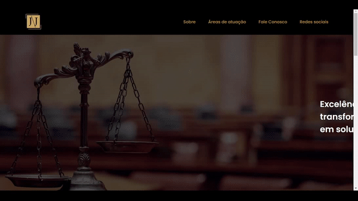

<h1 align="center"> Landing Page JJ </h1>

<p>Desenvolvimento de uma landing page para um advogado. </p>

<p align="center">
  
</p>

<br>

## 💻 Tecnologias
- HTML
- CSS

<br>

## 🚀 Iniciando
Clone o projeto e acesse a pasta.

```bash
$ git clone https://github.com/DenilsonMelo/landing-page-jj.git
$ cd landing-page-jj
```

Acesse a pasta src e abra o arquivo ```index.html```